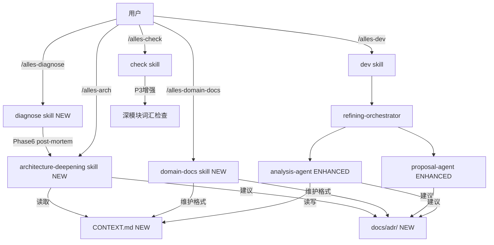

## 用户需求

对 `harness-task` 进行一次系统性重构，包含以下三个方向：

### 1. 修复现有缺陷 + 开源规范优化

- 修复 `bin/harness-task.js` 中 `check` skill 和 `alles-check` 命令未被安装的链路漂移 bug
- 补全 README.md 中缺失的 `/alles-check` 命令文档
- 增强现有 skill 质量：`tdd` 补充深模块原则、`check` 的 P3 架构维度补充、`bug-investigator` 加入反馈循环前置约束

### 2. 新增四个能力

- **`domain-docs` skill**：让用户可以为项目手动维护领域词汇表（`CONTEXT.md`）和架构决策记录（`docs/adr/`），提供格式规范和懒创建机制
- **`grill-with-docs` 增强**：不作为独立 skill，而是将其核心思想注入 `analysis-agent`，在提问时主动检查术语与代码/`CONTEXT.md` 的一致性，答案收敛后立即更新 `CONTEXT.md`，重大决策满足三条件时建议 ADR
- **`diagnose` skill**：独立 skill，结构化 bug 诊断六阶段流程（建立反馈循环 → 复现 → 假设 → Instrument → Fix + 回归测试 → Cleanup），与现有 `bugfix`/`bug-investigator` 并存但定位不同（diagnose 面向任意 bug 调试，bugfix 面向工作流内 phase 级回滚）
- **`architecture-deepening` skill**：独立 skill，基于深模块词汇（Module/Interface/Seam/Adapter/Depth/Leverage/Locality）和 deletion test 原则，扫描代码库提出浅模块改进候选，集成 `CONTEXT.md`/ADR 感知

### 3. 安装器同步

所有新增 skill 和命令需同步到 `bin/harness-task.js` 的三个列表，确保 npm install 和手动 sync 脚本无漂移。

## 核心功能描述

- 用户可通过 `/alles-check` 在编码前做三视角规划评审（已有，修复安装链路使其可用）
- 用户可通过 `domain-docs` skill 懒性建立和更新 `CONTEXT.md`/ADR，`analysis-agent` 在提问时会读取并保持语言一致性
- 用户可通过 `diagnose` skill 对任意 bug 进行有纪律的诊断，与工作流解耦
- 用户可通过 `architecture-deepening` skill 定期扫描代码库发现深模块改进机会

## 技术栈

- 现有项目：Node.js (ESM) + TypeScript，文档驱动 skill 体系（`SKILL.md` 定义行为，frontmatter 定义元数据）
- 新增内容：纯 Markdown skill 文件 + `bin/harness-task.js` 列表更新，无需新增 TypeScript 逻辑

## 实现策略

### 架构约束（不可打破）

1. Skill frontmatter 必须包含 `name`、`description`，用户可调用的 skill 加 `user-invocable: true`
2. `analysis-agent` 的 4 个 checkpoint 结构（Category 1→2→3→Proposal）和 `question_checkpoint` 计数器不变
3. `refining-orchestrator` 的 dispatch table 是权威，不引入新 agent 来打断 checkpoint 推进
4. `bin/harness-task.js` 中 `transformText` 函数会将 `harness-task:{id}` 替换为 `harness-task-{id}`，新 skill 引用需遵循此命名
5. `SKILL_IDS`、`AGENT_IDS`、`COMMAND_IDS`、`COMMAND_META` 四个常量需保持同步（当前有漂移）

### 各改动点策略

**修复安装链路漂移**

在 `bin/harness-task.js` 中，`transformText` 函数内部、顶层 `SKILL_IDS`、`COMMAND_IDS`、`COMMAND_META` 三处同步添加 `check` 和 `alles-check`，保证 npm 安装路径与 sync 脚本一致。

**`domain-docs` skill**

独立 skill，供用户手动调用，定义 `CONTEXT.md` 和 `docs/adr/` 的格式规范、懒创建规则、单/多上下文结构（`CONTEXT-MAP.md`）。内容参照 `tmp/skills` 中 `CONTEXT-FORMAT.md` 和 `ADR-FORMAT.md`，但适配 harness-task 的项目配置目录（`.harness-task/context.md` 已有，新增 `CONTEXT.md` 领域词汇表），新增命令 `/alles-domain-docs`。

**`analysis-agent` 增强（grill-with-docs 思想注入）**

不拆分 checkpoint 结构，在 `Phase B: Code Exploration` 和 `Phase C: Category Loop` 增加三条规则：

- 探索代码时同时读取 `CONTEXT.md`（若存在），记录当前领域词汇
- 提问时若发现用户使用的术语与 `CONTEXT.md` 冲突，立即单独指出，不与其他问题混合
- 某个 Category 完成后，若产生新的领域术语，更新 `CONTEXT.md`；若满足 ADR 三条件（难逆转 + 不问会困惑 + 有真实取舍），建议创建 `docs/adr/`

**`diagnose` skill**

独立 skill，不修改 `bugfix` 流程。六阶段：Phase 1（建立反馈循环，最高优先级）、Phase 2（复现）、Phase 3（3-5 个可证伪假设，先给用户排名再测）、Phase 4（Instrument，单变量，唯一前缀 `[DEBUG-xxxx]`）、Phase 5（先写 regression test 再 fix，只在有正确 seam 时）、Phase 6（cleanup + post-mortem，grep 清理 debug log）。新增命令 `/alles-diagnose`。

**`architecture-deepening` skill**

独立 skill，不修改 `check` 和 `review`。流程：读 `CONTEXT.md`/ADR → 用 explore subagent 扫描 → 应用 deletion test → 列出 deepening candidates（Files/Problem/Solution/Benefits） → grilling loop → 发现新术语时更新 `CONTEXT.md` / 建议 ADR。新增命令 `/alles-arch`。

**现有 skill 增强（不破坏原有行为）**

- `skills/tdd/SKILL.md`：补充"深模块"部分，区分集成测试与单元测试的选择原则，SDK-style mock 边界建议
- `skills/check/SKILL.md`：P3 架构维度添加深模块词汇检查问题（Module/Interface/Seam 等）
- `agents/bug-investigator.md`：在 Step 3 注入日志之前，增加 Phase 0 "建立反馈循环"要求——必须先构造一个 agent 可运行的 pass/fail 信号，再注入日志

## 实现注意事项

- `domain-docs` 中的 `CONTEXT.md` 与现有 `.harness-task/context.md` 定位不同：前者是领域词汇表（DDD 风格），后者是工程配置注入（架构约束、编码规范）；两者共存，互不覆盖
- `analysis-agent` 改动必须加 "读 CONTEXT.md 是软可选行为" 的限定，避免因项目没有 `CONTEXT.md` 而报错
- `diagnose` skill 与 `bugfix` skill 的定位差异：`diagnose` 是通用调试工具（可在工作流外使用），`bugfix` 是工作流内 phase 级回滚（有 status.json 重置）；`using-harness-task` skill 需补充这一说明
- 新 skill 的 `description` 字段（agent 路由依据）需包含 "Use when" 触发条件，长度 < 1024 字符
- 所有新增 skill 需在 `bin/harness-task.js` 的 `transformText` 函数内部 `SKILL_IDS` 数组和顶层 `SKILL_IDS` 常量两处同时添加

## 架构设计



## 目录结构

```
harness-task/
├── agents/
│   ├── analysis-agent.md          # [MODIFY] 增加 CONTEXT.md 读取、术语一致性检查、ADR 三条件建议
│   ├── bug-investigator.md        # [MODIFY] 注入日志前增加 Phase 0 反馈循环建立要求
│   ├── phase-reviewer.md          # [NO CHANGE]
│   └── proposal-agent.md          # [MODIFY] 生成 proposal 时在 Risks 节建议 ADR
├── bin/
│   └── harness-task.js            # [MODIFY] 修复 check 漂移；添加新 skill/command 注册
├── commands/
│   ├── alles-check.md             # [NO CHANGE]
│   ├── alles-diagnose.md          # [NEW] 调用 harness-task:diagnose
│   ├── alles-arch.md              # [NEW] 调用 harness-task:architecture-deepening
│   ├── alles-domain-docs.md       # [NEW] 调用 harness-task:domain-docs
│   └── ... (其余不变)
├── skills/
│   ├── check/SKILL.md             # [MODIFY] P3 架构维度增加深模块检查问题
│   ├── diagnose/SKILL.md          # [NEW] 六阶段 bug 诊断 skill
│   ├── architecture-deepening/
│   │   ├── SKILL.md               # [NEW] 深模块扫描主 skill
│   │   └── LANGUAGE.md            # [NEW] Module/Interface/Seam/Adapter 词汇表（参照 tmp/skills）
│   ├── domain-docs/
│   │   ├── SKILL.md               # [NEW] 领域文档管理 skill
│   │   ├── CONTEXT-FORMAT.md      # [NEW] CONTEXT.md 格式规范（参照 tmp/skills）
│   │   └── ADR-FORMAT.md          # [NEW] ADR 格式规范（参照 tmp/skills）
│   ├── tdd/SKILL.md               # [MODIFY] 补充深模块原则、mock 边界指南
│   ├── using-harness-task/SKILL.md # [MODIFY] 补充 diagnose 与 bugfix 定位差异说明
│   └── ... (其余不变)
├── README.md                       # [MODIFY] 补充 /alles-check、/alles-diagnose、/alles-arch、/alles-domain-docs
├── README.zh-CN.md                 # [MODIFY] 同步中文文档
└── tests/
    └── installer.test.ts           # [MODIFY] 增加 skill/command 列表一致性测试，防止再次漂移
```

## 使用的 Agent 扩展

### SubAgent

- **code-explorer**
- 用途：在实施 `architecture-deepening` skill 的 `SKILL.md` 时，需要验证现有 `improve-codebase-architecture` 的词汇表和 deletion test 原则，确保新 skill 与参考材料完全对齐
- 预期结果：确认词汇定义和流程描述的精确性，避免实现时偏离原设计